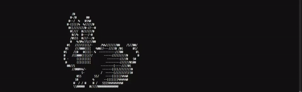
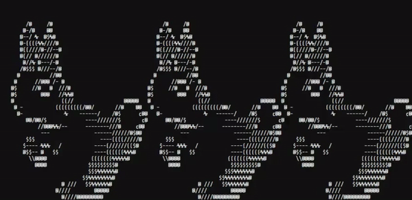

# Google-FooBar

My solutions for Google FooBar.
These problems and my solutions to them might be quite 
helpful if you are preparing for a coding interview or are just interested in coding.

**Note: all these solutions are written in Python.**



[Foo.Bar URL](https://foobar.withgoogle.com/)

I would strongly advise you to go over `Challenge 5`. I felt it was a real SOTA (state of the art) problem, seems very easy problem
while reading, hard when you try to code and the optimal solution is just a few lines (Here: <15 lines).

## At the End!

```
Level 1 100% [==========================================]
Level 2 100% [==========================================]
Level 3 100% [==========================================]
Level 4 100% [==========================================]
Level 5 100% [==========================================]

<encrypted>
CU4AHQoXSxcSQExTUk4UGgwVWkNNR0sKHQUfDQgTWwFGR1ZJVQwAHAwRQwEFQEBJVQwVDgYGWhdG R1ZJVQAdCxsRSg0DCwlOXklUCQocRwEXAgEMHB1USFNUCREPCwMKGQwXT0VUCRYABQ4ABhpUSFNU CRcAAQlOXklUDgYbCURbR0seGwdSTxQ=
</encrypted>
```

The decoded message I received-

```
"{'success' : 'great', 'colleague' : 'esteemed', 'efforts' : 'incredible', 'achievement' : 'unlocked', 'rabbits' : 'safe', 'foo' : 'win!'}"
```

## Another cool anime (from FooBar)


